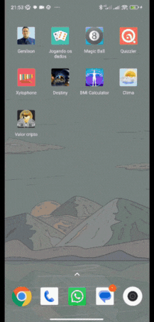

#  

## Skills

           

|  |  |  |
| :----------------------------------------------------------- | :----------------------------------------------------------- | :----------------------------------------------------------- |
|  |  |  |
|  |  |  |

   
