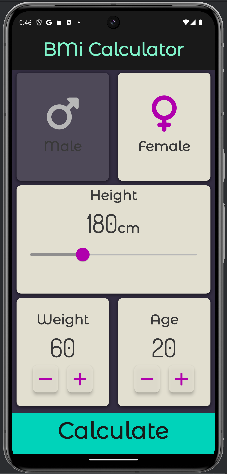
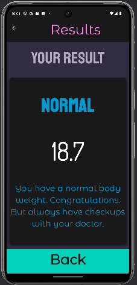

# BMi Calculator 🚹 ⚖️🚺

[](https://www.linkedin.com/in/genilson-do-carmo-8a42b89a/) [](https://www.instagram.com/genilson_carmo/)

## This is my seventh Flutter project.

###  Skills

```
 font_awesome_flutter: ^10.7.0
 MaterialPageRoute
 Custom components
```

<p align="left">
     
</p>
 


|  |  |  |
| ------------------------------------------------------ | ------------------------------------------------------------ | ------------------------------------------------------ |

