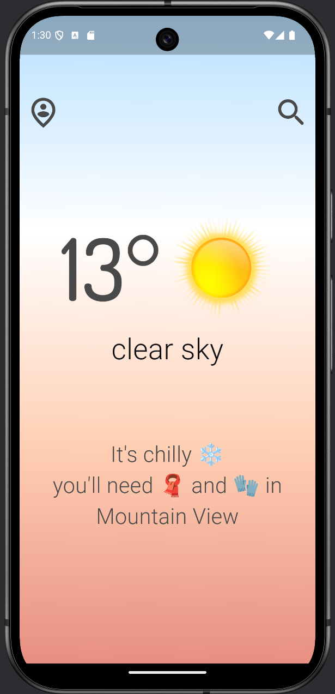
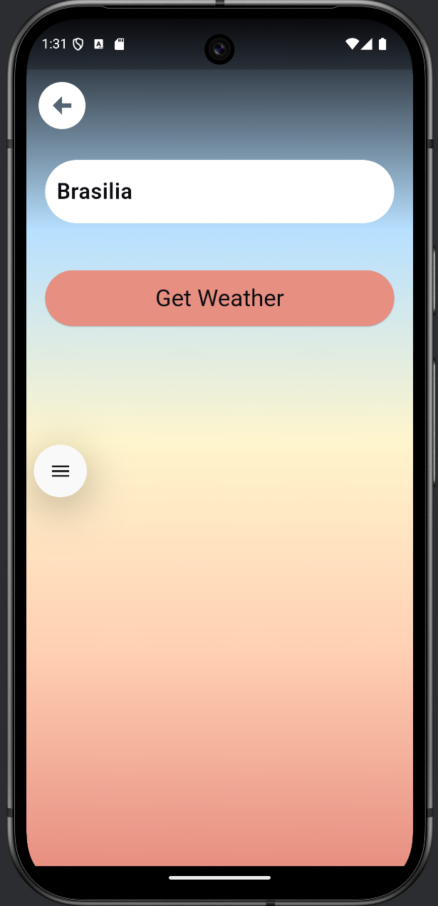
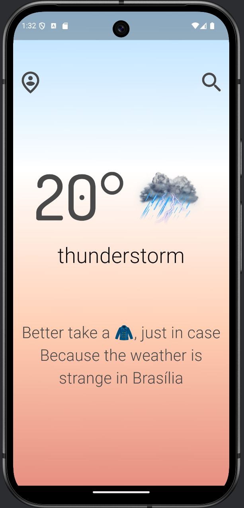
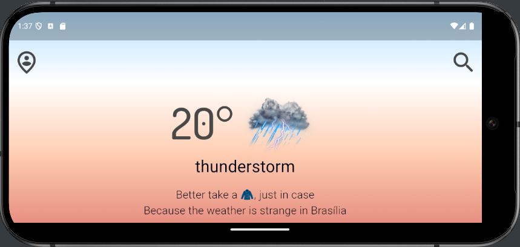

# Clima  2🌤️

[](https://www.linkedin.com/in/genilson-do-carmo-8a42b89a/) [](https://www.instagram.com/genilson_carmo/)

## This  is version 2 of the  Clima  app.

###  Skills

```
  API Rest : https://openweathermap.org/
  geolocator: 13.0.2
  geolocator_android: 4.6.1
  permission_handler: ^11.4.0
  http: ^1.2.1
  convert: ^3.1.1
  flutter_spinkit: ^5.2.1
  auto_size_text: ^3.0.0
  MaterialPageRoute
  Custom components
```

<p align="left">
     
</p>
 

|  |  |
| ------------------------------------------------------------ | ------------------------------------------------------------ |
|  |  |
