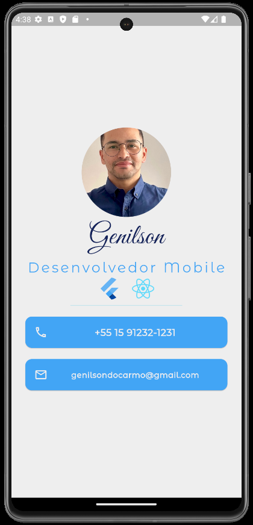
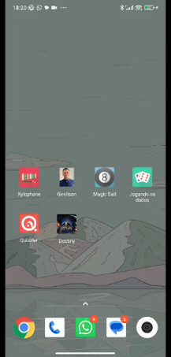

# Mi Card

## 🐛 This is my first Flutter project .  

 

###  Skills

     

  

|  |  |
| :----------------------------------------------------------- | :----------------------------------------------------------- |

